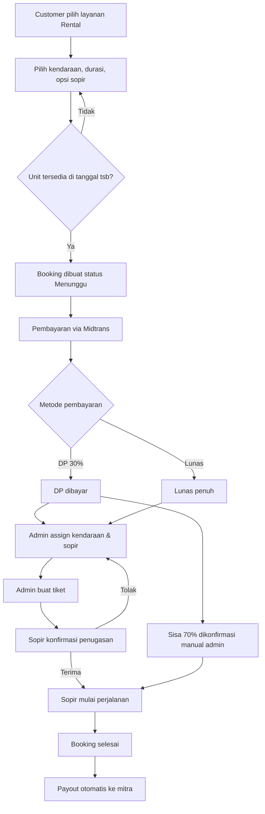
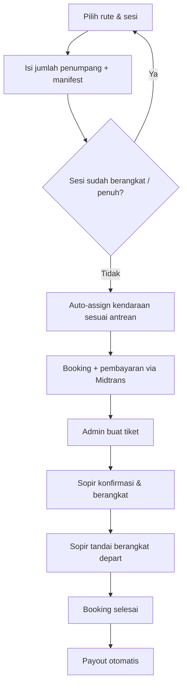
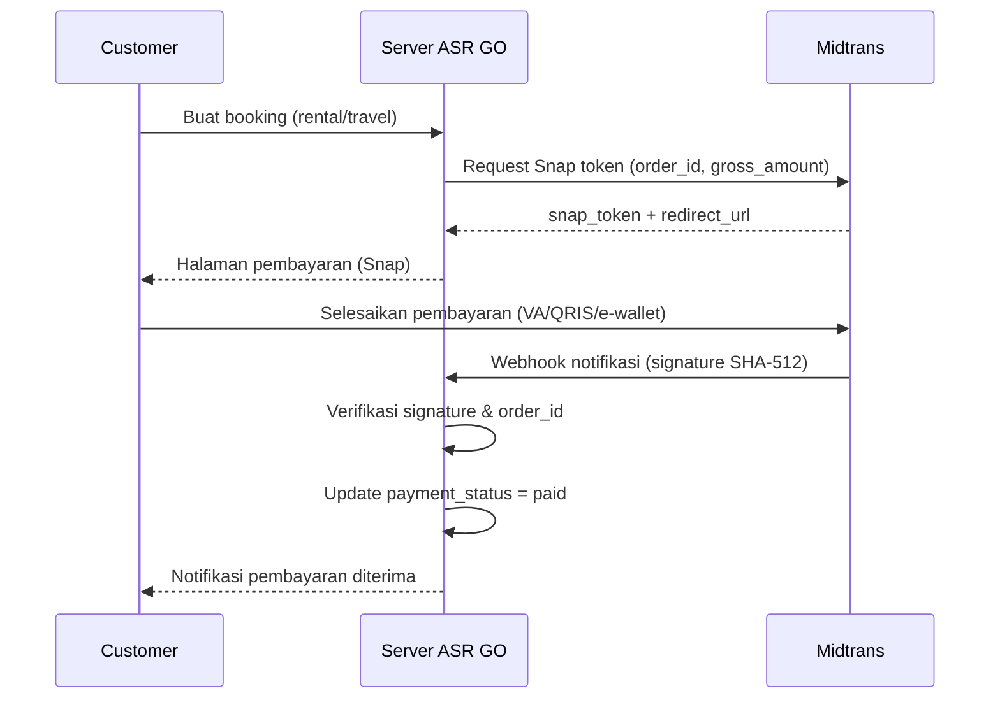

# BAB 3 — ANALISIS DAN PERANCANGAN SISTEM
## Sistem Informasi Penyewaan Kendaraan & Travel "ASR GO" (Flores, NTT)

---

## 3.1 Analisis Kebutuhan Sistem

### 3.1.1 Kebutuhan Fungsional

**Aktor Customer (Pemesan)**
1. Sistem menyediakan registrasi dan login akun.
2. Sistem menampilkan katalog kendaraan beserta harga sewa (dengan/tanpa sopir).
3. Sistem menerima pemesanan rental (kendaraan, durasi 0,5–7 hari, pilihan sopir).
4. Sistem menerima pemesanan travel (rute, sesi pagi/siang, jumlah penumpang, data penumpang/manifest).
5. Sistem menolak pemesanan travel pada sesi yang sudah berangkat atau penuh.
6. Sistem melakukan pembayaran via Midtrans (skema DP 30% atau lunas penuh).
7. Sistem menampilkan tiket, invoice, dan detail booking beserta timeline progres.
8. Sistem menerima pengajuan refund (kecuali travel yang sudah berangkat).
9. Sistem menerima ulasan/rating setelah booking selesai.
10. Sistem menerima pembatalan booking yang belum dibayar.
11. Sistem menampilkan notifikasi (pembayaran, penugasan sopir, keberangkatan, dll).

**Aktor Admin (Operator)**
1. Sistem menampilkan dashboard berisi grafik tren booking/pendapatan 6 bulan, booking per layanan, dan status booking.
2. Sistem menampilkan Papan Booking dengan filter status pembayaran dan pencarian (no. booking, nama/email customer, plat/nama kendaraan, no. tiket).
3. Sistem menerima penugasan kendaraan dan sopir ke booking (dengan cek konflik tanggal).
4. Sistem menerima pembuatan tiket, penandaan lunas (sisa 70% manual), pembatalan booking, dan edit detail booking (tanggal, total, kontak, catatan).
5. Sistem menerima persetujuan/penolakan refund (refund diproses otomatis ke Midtrans).
6. Sistem menampilkan laporan keuangan (ringkasan pendapatan, payout) beserta cetak PDF dan export CSV.
7. Sistem mengelola master data: kendaraan, sopir, mitra, rute travel, bagi hasil.
8. Sistem mengelola pengguna (reset password, aktif/nonaktif akun).
9. Sistem mengelola ulasan (menghapus ulasan yang tidak pantas).
10. Sistem menampilkan audit log seluruh aksi penting admin.

**Aktor Mitra (Pemilik Armada)**
1. Sistem menerima pendaftaran kendaraan milik mitra (dengan foto) untuk disetujui admin.
2. Sistem menampilkan dashboard berisi statistik unit dan pendapatan bulan ini.
3. Sistem menampilkan riwayat payout dan performa pendapatan per unit.
4. Sistem menampilkan notifikasi payout.

**Aktor Driver (Sopir)**
1. Sistem menampilkan jadwal booking yang ditugaskan beserta kontak customer.
2. Sistem menerima konfirmasi penugasan (terima/tolak).
3. Sistem menerima penandaan mulai perjalanan dan selesai booking.
4. Sistem menerima laporan kendala (kendaraan bermasalah, kemacetan, penumpang tidak hadir).
5. Sistem menampilkan notifikasi penugasan.

### 3.1.2 Kebutuhan Non-Fungsional
1. **Keamanan**: autentikasi dan otorisasi berbasis role (admin/customer/mitra/driver), policy per aksi, proteksi CSRF, rate limiting login (6 percobaan/menit/IP), verifikasi signature webhook Midtrans (SHA-512), blokir akun nonaktif, audit log.
2. **Integritas data**: transaksi database (DB transaction) pada pembuatan booking dan payout, cek konflik kendaraan/sopir anti double-booking, relasi foreign key.
3. **Performa**: eager loading relasi, pagination data, indeks kolom pencarian.
4. **Usabilitas**: antarmuka responsif (Tailwind CSS), Bahasa Indonesia, tanpa emoji.
5. **Kompatibilitas**: PHP 8.4 / Laravel 12, MySQL 8, Chart.js, Alpine.js.

---

## 3.2 Perancangan Sistem

### 3.2.1 Use Case Diagram

```mermaid
graph TD
    subgraph Sistem ASR GO
        UC1[Registrasi & Login]
        UC2[Booking Rental]
        UC3[Booking Travel + Manifest]
        UC4[Pembayaran Midtrans]
        UC5[Lihat Tiket & Invoice]
        UC6[Pengajuan Refund]
        UC7[Beri Ulasan]
        UC8[Kelola Papan Booking]
        UC9[Kelola Master Data]
        UC10[Laporan Keuangan]
        UC11[Kelola Pengguna]
        UC12[Audit Log]
        UC13[Kelola Kendaraan]
        UC14[Lihat Pendapatan & Payout]
        UC15[Konfirmasi Penugasan]
        UC16[Update Perjalanan]
        UC17[Lapor Kendala]
    end

    C[Customer] --> UC1 & UC2 & UC3 & UC4 & UC5 & UC6 & UC7
    A[Admin] --> UC8 & UC9 & UC10 & UC11 & UC12
    M[Mitra] --> UC13 & UC14
    D[Driver] --> UC15 & UC16 & UC17
    A --> UC4
```



**Deskripsi use case utama:**

| Kode | Use Case | Aktor | Deskripsi |
|---|---|---|---|
| UC2 | Booking Rental | Customer | Pilih kendaraan, durasi, opsi sopir; sistem cek konflik tanggal lalu membuat booking berstatus *pending*. |
| UC3 | Booking Travel | Customer | Pilih rute, sesi, jumlah penumpang; isi manifest (nama + no. HP); sistem auto-assign kendaraan sesuai kapasitas dan antrean armada. |
| UC4 | Pembayaran | Customer, Admin | Customer bayar via Snap Midtrans (DP 30% untuk rental atau lunas); webhook diverifikasi signature-nya; sisa 70% rental dikonfirmasi manual oleh admin. |
| UC8 | Kelola Papan Booking | Admin | Filter, cari, assign sopir/kendaraan, buat tiket, tandai lunas, batalkan, edit detail, setujui/tolak refund, cairkan payout. |
| UC15 | Konfirmasi Penugasan | Driver | Sopir menerima atau menolak penugasan; penolakan mengembalikan booking ke antrean dan menotifikasi admin. |
| UC16 | Update Perjalanan | Driver | Sopir menandai mulai perjalanan dan selesai; status selesai memicu pembuatan payout otomatis. |

### 3.2.2 Activity Diagram — Alur Booking Rental



### 3.2.3 Activity Diagram — Alur Booking Travel



### 3.2.4 Sequence Diagram — Pembayaran Midtrans



### 3.2.5 Entity Relationship Diagram (ERD)

```mermaid
erDiagram
    USERS ||--o{ BOOKINGS : "pelanggan"
    USERS ||--o{ BOOKINGS : "sopir"
    USERS ||--o{ VEHICLES : "mitra"
    USERS ||--o{ VEHICLES : "sopir kendaraan"
    USERS ||--o{ PAYOUTS : "mitra"
    USERS ||--o{ REVIEWS : "customer"
    USERS ||--o{ NOTIFICATION_LOGS : ""
    USERS ||--o{ DRIVER_REPORTS : "driver"
    USERS ||--o{ AUDIT_LOGS : ""

    CITIES ||--o{ ROUTES : "origin"
    CITIES ||--o{ ROUTES : "destination"
    ROUTES ||--o{ ROUTE_ASSIGNMENTS : ""
    MITRA ||--o{ ROUTE_ASSIGNMENTS : ""
    VEHICLES ||--o{ ROUTE_ASSIGNMENTS : ""
    ROUTES ||--o{ BOOKINGS : ""
    VEHICLES ||--o{ BOOKINGS : ""
    BOOKINGS ||--o{ BOOKING_PASSENGERS : ""
    BOOKINGS ||--o{ REVIEWS : ""
    BOOKINGS ||--o{ PAYOUTS : ""
    BOOKINGS ||--o{ DRIVER_REPORTS : ""
    ROUTE_ASSIGNMENTS ||--o{ TRAVEL_DEPARTURES : ""
    VEHICLES ||--o{ TRAVEL_DEPARTURES : ""
    ROUTES ||--o{ TRAVEL_DEPARTURES : ""
    USERS ||--o{ REVENUE_SHARES : "mitra"

    USERS {
        bigint id PK
        string name
        string email UK
        string password
        string role
        boolean is_active
    }
    VEHICLES {
        bigint id PK
        bigint mitra_id FK
        bigint sopir_id FK
        string nama
        string plat_nomor
        string jenis
        decimal harga_sewa_per_hari
        string status
        boolean is_approved
        int prioritas_travel
    }
    ROUTES {
        bigint id PK
        string origin
        string destination
        decimal price
        string service_type
    }
    BOOKINGS {
        bigint id PK
        bigint pelanggan_id FK
        bigint vehicle_id FK
        bigint route_id FK
        bigint sopir_id FK
        string service_type
        string session
        int jumlah_penumpang
        date tanggal_mulai
        date tanggal_selesai
        string status
        decimal total_harga
        string payment_status
        string payment_scheme
        timestamp driver_confirmed_at
        timestamp perjalanan_dimulai_at
        string contact_hp
        string refund_status
    }
    PAYOUTS {
        bigint id PK
        bigint booking_id FK
        bigint mitra_id FK
        decimal jumlah_mitra
        decimal jumlah_platform
        string status_pencairan
    }
    REVENUE_SHARES {
        bigint id PK
        bigint mitra_id FK
        decimal persen_platform
        decimal persen_mitra
    }
    REVIEWS {
        bigint id PK
        bigint booking_id FK UK
        bigint customer_id FK
        tinyint rating
        text komentar
    }
    BOOKING_PASSENGERS {
        bigint id PK
        bigint booking_id FK
        string nama
        string no_hp
        tinyint urutan
    }
    TRAVEL_DEPARTURES {
        bigint id PK
        bigint route_assignment_id FK
        bigint route_id FK
        bigint vehicle_id FK
        bigint driver_id FK
        date departure_date
        string session
        timestamp departed_at
    }
    DRIVER_REPORTS {
        bigint id PK
        bigint booking_id FK
        bigint driver_id FK
        string kategori
        text keterangan
        string status
    }
    NOTIFICATION_LOGS {
        bigint id PK
        bigint user_id FK
        string type
        string message
        string related_model
        bigint related_id
    }
    AUDIT_LOGS {
        bigint id PK
        bigint user_id FK
        string action
        string description
        string ip_address
    }
```

**Deskripsi tabel utama:**

| Tabel | Fungsi |
|---|---|
| `users` | Data pengguna 4 role (admin, customer, mitra, driver); kolom `is_active` untuk blokir akun. |
| `vehicles` | Kendaraan milik mitra; `status` (tersedia/disewa/maintenance); `prioritas_travel` untuk antrean armada travel; butuh persetujuan admin (`is_approved`). |
| `routes` | Rute travel antar kota di Flores (origin/destination mengacu `cities`). |
| `route_assignments` | Penugasan armada mitra ke rute + sesi; basis auto-assign kendaraan. |
| `bookings` | Pemesanan rental/travel; menyimpan status, pembayaran (scheme DP/lunas), konfirmasi sopir, waktu perjalanan, refund. |
| `booking_passengers` | Manifest penumpang travel (nama + no. HP). |
| `reviews` | Ulasan customer (1 booking maksimal 1 ulasan, constraint UNIQUE). |
| `travel_departures` | Catatan keberangkatan armada (dikonfirmasi sopir); dipakai untuk memblokir booking sesi yang sudah berangkat. |
| `payouts` | Pencairan dana ke mitra (80%) dan platform (20%) per booking selesai; `status_pencairan` pending/paid. |
| `revenue_shares` | Konfigurasi bagi hasil (default 20% platform / 80% mitra, bisa spesifik per mitra). |
| `driver_reports` | Laporan kendala dari sopir (kendaraan, macet, no-show, lainnya). |
| `notification_logs` | Notifikasi dalam sistem untuk semua role. |
| `audit_logs` | Jejak aksi admin (approve, cancel, refund, payout, reset password, dll). |

### 3.2.6 Sitemap

```
ASR GO
├── Landing (katalog kendaraan & layanan)
├── Autentikasi
│   ├── Login
│   ├── Register
│   └── Lupa Password
├── Customer (/customer)
│   ├── Dashboard
│   ├── Booking
│   │   ├── Buat Booking (rental/travel)
│   │   ├── Riwayat Booking
│   │   ├── Detail Booking (timeline progres)
│   │   └── Invoice (cetak PDF)
│   ├── Pembayaran (Midtrans Snap)
│   ├── Tiket
│   ├── Notifikasi
│   └── Profil
├── Admin (/admin)
│   ├── Dashboard (grafik)
│   ├── Papan Booking (filter, cari, assign, tiket, refund, edit, cancel)
│   ├── Kelola Kendaraan
│   ├── Kelola Sopir
│   ├── Kelola Mitra
│   ├── Kelola Rute
│   ├── Kelola Pengguna (reset password, aktif/nonaktif)
│   ├── Bagi Hasil
│   ├── Laporan Keuangan (cetak PDF)
│   ├── Ulasan
│   ├── Riwayat Aktivitas (audit log)
│   └── Notifikasi
├── Mitra (/mitra)
│   ├── Dashboard
│   ├── Kendaraan (CRUD + foto)
│   ├── Pendapatan (payout + performa unit)
│   └── Notifikasi
└── Driver (/driver)
    ├── Dashboard (jadwal hari ini)
    ├── Booking (konfirmasi, mulai perjalanan, lapor kendala, selesai)
    └── Notifikasi
```

---

## 3.3 Perancangan Antarmuka (Wireframe)

### 3.3.1 Landing Page
```
+--------------------------------------------------------------+
| [Logo ASR GO]        Home  Kendaraan  Layanan  Masuk  Daftar |
+--------------------------------------------------------------+
|  SELAMAT DATANG DI ASR GO                                     |
|  Sewa kendaraan & travel antar kota di Flores, NTT            |
|  [ Cari Kendaraan ]  [ Pesan Travel ]                         |
+--------------------------------------------------------------+
| Katalog Kendaraan (kartu: foto, nama, harga/hari, tombol sewa)|
| Layanan: Rental (dengan/tanpa sopir) | Travel antar kota      |
| Footer: kontak & info                                          |
+--------------------------------------------------------------+
```

### 3.3.2 Form Booking (satu halaman, toggle Rental/Travel)
```
+--------------------------------------------------------------+
| [Rental] [Travel]                                             |
| Kendaraan: [dropdown + kartu pilihan]   Durasi: [0.5-7 hari] |
| Dengan Sopir: [Ya/Tidak]                                     |
| Tanggal Mulai: [date]     Tanggal Selesai: [auto]            |
| No. HP Kontak: [text]                                        |
| [TRAVEL: Jumlah Penumpang -> baris manifest nama + no HP]    |
| [TRAVEL: Pilih Sesi Pagi/Siang + info ketersediaan]          |
| Ringkasan: Total Rp X        [ Buat Booking ]                |
+--------------------------------------------------------------+
```

### 3.3.3 Papan Booking Admin
```
+--------------------------------------------------------------+
| Papan Booking  [Cari: ...] [Filter Pembayaran: v] [Export CSV]|
| Kartu statistik: Semua | Belum Tiket | Tiket Dibuat           |
| +----+------+-----+-----+------+-------+-------+-------+----+|
| | ID | Cust | Plat| Unit| Sopir| Tanggal| Status| Total |Aksi||
| +----+------+-----+-----+------+-------+-------+-------+----+|
| Modal detail: info booking + assign sopir/kendaraan +         |
| buat tiket + tandai lunas + edit detail + refund + cancel     |
+--------------------------------------------------------------+
```

### 3.3.4 Detail Booking Customer
```
+--------------------------------------------------------------+
| Detail Booking #47                [Kembali ke Riwayat]        |
| [Rental] [Selesai]                                           |
| Kendaraan: Toyota Avanza | Sopir: Petrus | Tanggal: 5-7 Mar  |
| Pembayaran: Lunas Penuh | Total Rp 1.300.000                 |
| Progres: Dibuat -> Dibayar -> Sopir -> Tiket -> Selesai      |
| Aksi: [Lihat Tiket] [Cetak Invoice] [Beri Ulasan]            |
+--------------------------------------------------------------+
```

---

*Dokumen ini disusun berdasarkan implementasi aktual sistem (database 13 tabel bisnis, 85+ route, 66 test otomatis). Diagram Mermaid dapat dirender di Typora / VS Code (ekstensi Mermaid) / GitHub.*
